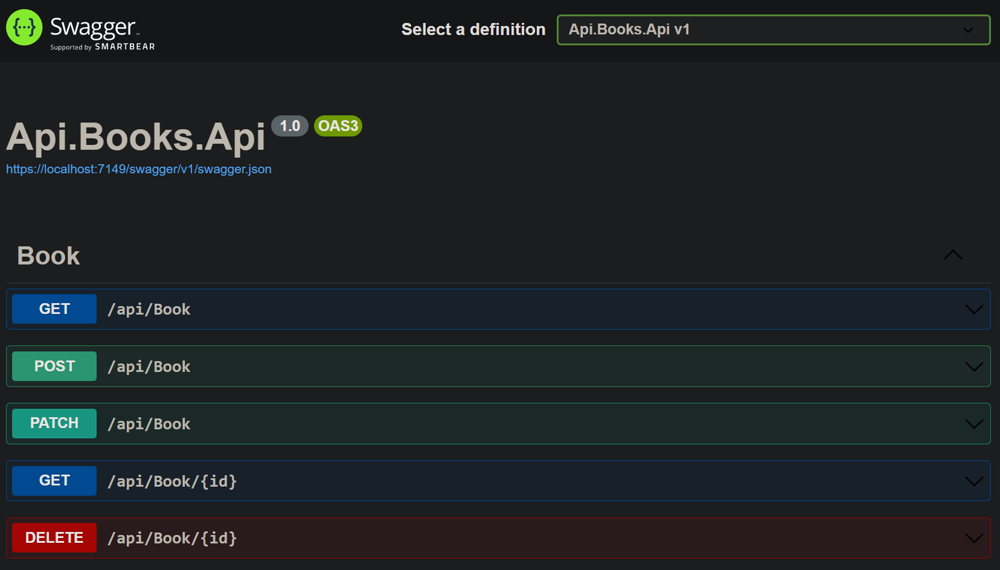

# Api em .Net 8, aplicando Clean Architecture e SOLID

- [Recursos](#recursos)
  - [Health Checks](#health-checks)
  - [Documentação APIs](#documentação-apis)
  - [Migrations](#migrations)
- [Desenvolvimento](#desenvolvimento)
  - [Requisitos](#requisitos)
  - [Instalação](#instalação)
    - [Docker](#docker-compose)
    - [.Net 8](#net-8)
    - [Visual Studio](#visual-studio)

## Recursos

### Health Checks

Use o endpoint `/ping` para verificação de saúde da aplicação. 

```json
{
  "response": "Pong"
}
```

### Documentação APIs

Para a documentação da api, é utilizado o [Swagger](https://swagger.io/).



Por padrão a documentação está disponível no endpoint `/swagger/index.html` .


### Migrations

Para as migrations, é utilizado o Entity Framework Core. 

Saiba mais sobre os [Migrations](https://learn.microsoft.com/pt-br/ef/core/managing-schemas/migrations/?tabs=dotnet-core-cli).

As tabelas são criadas automaticamente ao contexto do banco de dados

## Desenvolvimento

### Requisitos

```

* .Net 8
* Docker

```

### Instalação

#### Docker compose:

Acessar a pasta raiz do projeto e execute:

```

docker-compose up -d

```

#### .Net 8

```

link para download do .NET 8
https://dotnet.microsoft.com/pt-br/download/dotnet/8.0

```

#### Visual Studio

```

link para download do community(Esse projeto não esta vinculado ao vs, estou apenas facilitando o link para download)
https://visualstudio.microsoft.com/pt-br/vs/community/

```